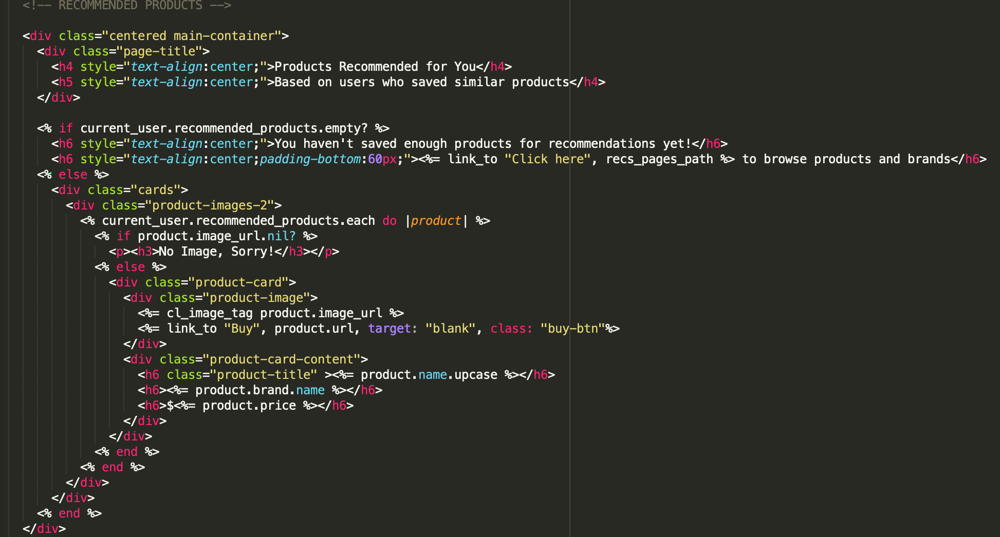

  <h2>LIGNE</h2>
  <h4><a href="http://www.my-ligne.com" target="blank" text-align="center">my-ligne.com</a></h4>
  <em>Problem:</em>
  
Brand discovery and fashion purchases are disconnected. People use different platforms to discover than they do to buy.

  <em>Solution:</em>
  
Editorial images from small international brands are featured randomly in a clean but endlessly scrolling page (similar to a Pinterest page).
  Users can like or unlike images they feel fit their personal style. They are then introduced
  to brands whose editorial images they have liked. Users can learn about the brand, add products to their carts, or share and compare products with friends. 

  <em>Context:</em>
  
We worked in a team of 4 and had one week from idea to execution. The process evolved from Figma prototypes to a live demonstration
  at the end of the week. My role was backend, using Ruby on Rails. Here's a peek at my work:

  <strong>Schema</strong>
  
I turned our team's concept and features into models through PostgreSQL. Our main models were products, users, and brands, but since there
  were multiple brand images per brand, we created a separate model for brand images as well. 

  

    
  

  <strong>Users</strong>
  
We used Devise for our user database. With Devise, I was able to save data to the current_user, including the brand images and products they have liked or added to cart.
  This later allowed us to run Recommendable to fit product reccommendations (see below). I also set permissions on pages that needed log-in authorizations.

  <strong>Scraping</strong>
  
Initially we tried to scrape data off e-commerce websites to populate our pages. However, since we were working with small brands,
    we had to rewrite our code for every brand which was too cumbersome. I ended up created a backend admin page for our team to seed data manually for our Demo Day.

    

    <small>Scraping data</small>
      
    

  <strong>References - Brands and Brand Images</strong>
  
Users see randomly ordered brand images on the main index page that they can like. Each brand has numerous images for our "Pinterest" page, so that we can collect more data
    for our collaborative filtering logic. The model and the backend admin page allowed for the creation of multiple brand images and a brand profile at the same time, saving the
    team time and energy. We used Carrier Wave and Cloudinary for the uploads.

  

    <small>Admin form for uploading multiple brand images and a brand at the same time</small>
    
  

  

    <small>Adding brand images in the brand controller via multiple uploads</small>
    
  

  

    <small>Liking mechanism for brand images in brand images controller</small>
    
  

<strong>Recommendations</strong>

We used the Recommendable gem to generate product recommendations with collaborative filtering logic. The liking mechanism we had on brand images and products fed the calculations. We used Redis to
  deliver recommendations and created jobs to recalculate the recommendations once every few days. We deployed on Heroku.

  

    <small>Recommendations view on the user's profile</small>
    
  

  

    <small>Job to recalculate recommendations</small>
    
  

